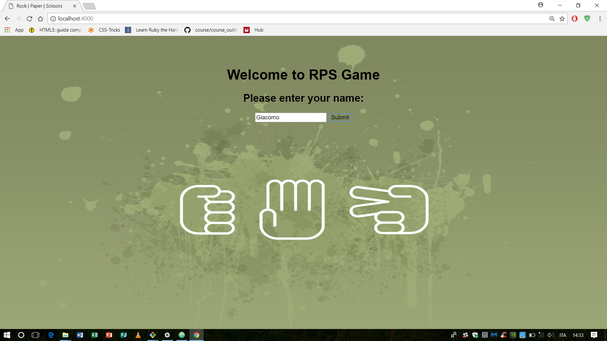
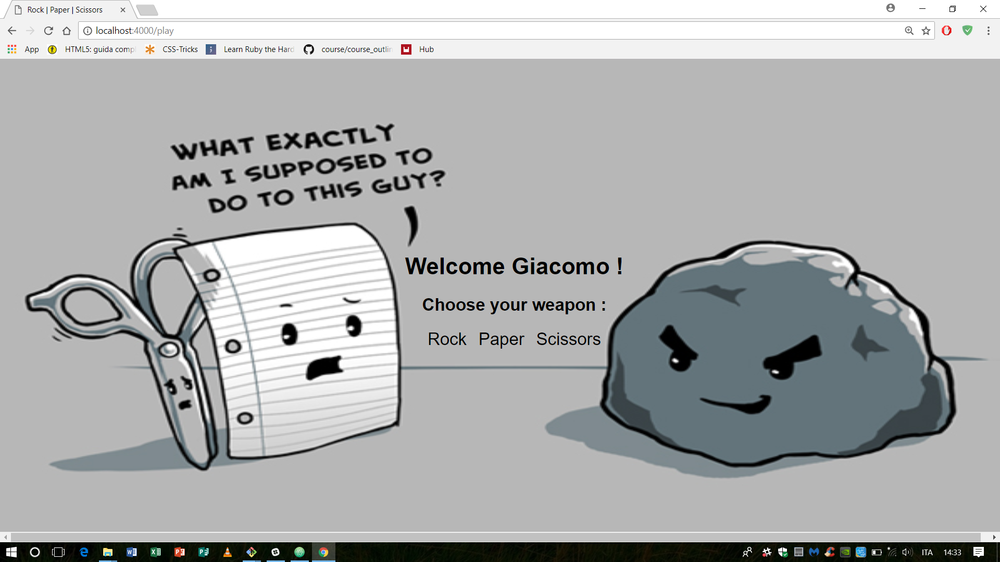
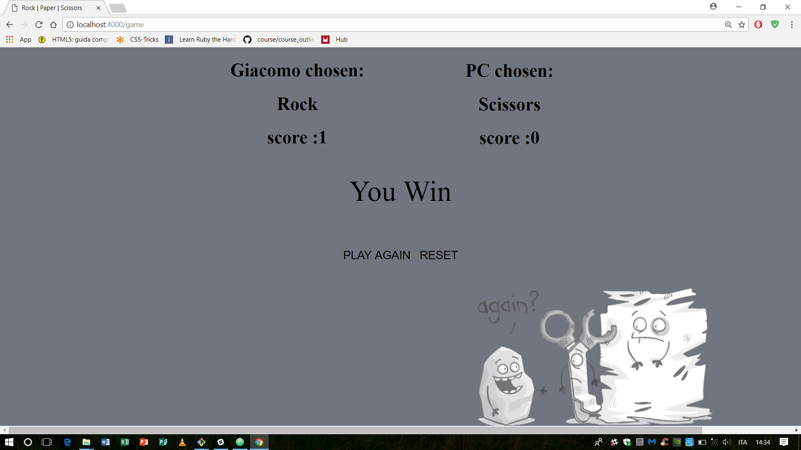

# Rock Paper Scissors (RPS) Game
A basic web application created using ruby, sinatra HTML and CSS, allowing users to play classic game of RPS.

### Getting Started
- Clone this repository.
- Run bundle install to install dependencies listed in Gemfile.
- Run shotgun config.ru

### Screenshots
Game starts asking user to insert own name.

Player can chose own weapon

Result of the battle.


### User Story
```
Functionality and user story implemented

As a marketeer
So that I can see my name in lights
I would like to register my name before playing an online game.

As a marketeer
So that I can enjoy myself away from the daily grind
I would like to be able to play rock/paper/scissors.

As a marketeer
So that I can enjoy myself away from the daily grind
I would like to be able to choose my weapon.

As a marketeer
So that I can enjoy myself away from the daily grind
I would like to see who won the game.

```

Hints on functionality

- the marketeer should be able to enter their name before the game
- the marketeer will be presented the choices (rock, paper and scissors)
- the marketeer can choose one option
- the game will choose a random option
- a winner will be declared
